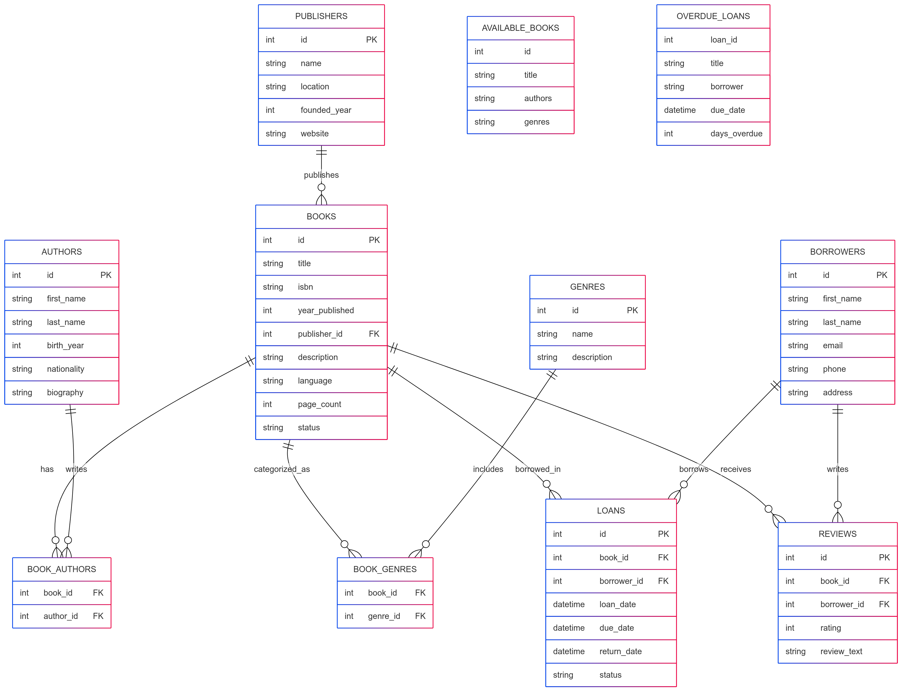

# Design Document

By Nguyen Le Ho Anh Khoa

Video overview: [https://youtu.be/-6p5fyYH0pI](https://youtu.be/-6p5fyYH0pI)

## Scope

The Book Management database includes all entities necessary to facilitate the management of a personal or public library. As such, included in the database's scope is:

* Books, including basic information such as title, author, publication year, ISBN code
* Authors, including personal information and biography
* Publishers, including name and contact information
* Book genres, to categorize books by topic
* Borrowers/readers, including personal information
* Book loan history, tracking the borrowing and returning of books
* Book reviews from readers, including ratings and comments

Out of scope are elements like financial management, new book acquisition, detailed statistics, and other non-essential attributes.

## Functional Requirements

This database will support:

* CRUD operations for books, authors, publishers, and borrowers
* Tracking book status (available, borrowed, in maintenance)
* Managing the book borrowing and returning process
* Searching for books by multiple criteria (title, author, genre, ISBN)
* Storing and displaying reader reviews and comments about books
* Basic statistics on most borrowed books, highest rated books

Note that in this iteration, the system will not support financial management or connection with external systems.

## Representation

Entities are captured in SQLite tables with the following schema.

### Entities

The database includes the following entities:

#### Books

The `books` table includes:

* `id`: a unique identifier for the book as an `INTEGER`. This column thus has the `PRIMARY KEY` constraint applied.
* `title`: the book's title as `TEXT`, not allowed to be NULL
* `isbn`: the book's ISBN code as `TEXT`, with a `UNIQUE` constraint to ensure no duplicate ISBNs
* `year_published`: publication year as `INTEGER`
* `publisher_id`: ID of the publisher as `INTEGER`, a `FOREIGN KEY` referencing the `publishers` table
* `description`: short description of the book as `TEXT`
* `language`: language of the book as `TEXT`
* `page_count`: number of pages as `INTEGER`
* `status`: current status of the book (available, borrowed, maintenance) as `TEXT`
* `added_date`: date the book was added to the system as `NUMERIC`, defaults to the current timestamp

#### Authors

The `authors` table includes:

* `id`: a unique identifier for the author as `INTEGER`. This column thus has the `PRIMARY KEY` constraint applied.
* `first_name`: author's first name as `TEXT`, not allowed to be NULL
* `last_name`: author's last name as `TEXT`, not allowed to be NULL
* `birth_year`: author's birth year as `INTEGER`
* `death_year`: author's year of death (if applicable) as `INTEGER`
* `biography`: short biography of the author as `TEXT`
* `nationality`: author's nationality as `TEXT`

#### Publishers

The `publishers` table includes:

* `id`: a unique identifier for the publisher as `INTEGER`. This column thus has the `PRIMARY KEY` constraint applied.
* `name`: publisher's name as `TEXT`, not allowed to be NULL
* `location`: publisher's location as `TEXT`
* `founded_year`: year established as `INTEGER`
* `website`: publisher's website as `TEXT`

#### Genres

The `genres` table includes:

* `id`: a unique identifier for the genre as `INTEGER`. This column thus has the `PRIMARY KEY` constraint applied.
* `name`: genre name as `TEXT`, not allowed to be NULL, with a `UNIQUE` constraint
* `description`: description of the genre as `TEXT`

#### Borrowers

The `borrowers` table includes:

* `id`: a unique identifier for the borrower as `INTEGER`. This column thus has the `PRIMARY KEY` constraint applied.
* `first_name`: borrower's first name as `TEXT`, not allowed to be NULL
* `last_name`: borrower's last name as `TEXT`, not allowed to be NULL
* `email`: email address as `TEXT`, with a `UNIQUE` constraint
* `phone`: phone number as `TEXT`
* `address`: address as `TEXT`
* `registration_date`: registration date as `NUMERIC`, defaults to the current timestamp

#### Book_Authors (Junction Table)

The `book_authors` table includes:

* `book_id`: ID of the book as `INTEGER`, a `FOREIGN KEY` referencing the `books` table
* `author_id`: ID of the author as `INTEGER`, a `FOREIGN KEY` referencing the `authors` table
* Both columns together form a composite `PRIMARY KEY`

#### Book_Genres (Junction Table)

The `book_genres` table includes:

* `book_id`: ID of the book as `INTEGER`, a `FOREIGN KEY` referencing the `books` table
* `genre_id`: ID of the genre as `INTEGER`, a `FOREIGN KEY` referencing the `genres` table
* Both columns together form a composite `PRIMARY KEY`

#### Loans

The `loans` table includes:

* `id`: a unique identifier for the loan as `INTEGER`. This column thus has the `PRIMARY KEY` constraint applied.
* `book_id`: ID of the borrowed book as `INTEGER`, a `FOREIGN KEY` referencing the `books` table
* `borrower_id`: ID of the borrower as `INTEGER`, a `FOREIGN KEY` referencing the `borrowers` table
* `loan_date`: date of borrowing as `NUMERIC`, defaults to the current timestamp
* `due_date`: due date for return as `NUMERIC`, not allowed to be NULL
* `return_date`: actual return date as `NUMERIC`, may be NULL if not yet returned
* `status`: loan status (active, returned, overdue) as `TEXT`

#### Reviews

The `reviews` table includes:

* `id`: a unique identifier for the review as `INTEGER`. This column thus has the `PRIMARY KEY` constraint applied.
* `book_id`: ID of the reviewed book as `INTEGER`, a `FOREIGN KEY` referencing the `books` table
* `borrower_id`: ID of the reviewer as `INTEGER`, a `FOREIGN KEY` referencing the `borrowers` table
* `rating`: rating score (1-5) as `INTEGER` with a CHECK constraint to ensure values between 1 and 5
* `review_text`: review content as `TEXT`
* `review_date`: review date as `NUMERIC`, defaults to the current timestamp

### Relationships

The entity relationship diagram below describes the relationships among the entities in the database.

As detailed by the diagram:

* A book can have one or more authors, and an author can write zero or many books. This is a many-to-many relationship implemented through the `book_authors` junction table.
* A book belongs to one publisher, while a publisher can publish zero or many books.
* A book can belong to one or more genres, and a genre can apply to zero or many books. This is a many-to-many relationship implemented through the `book_genres` junction table.
* A book can be borrowed zero or many times (through different loan instances), and each loan involves one and only one book.
* A borrower can borrow zero or many books, and each loan is made by one and only one borrower.
* A book can receive zero or many reviews, and each review is for one and only one book.
* A borrower can write zero or many reviews, and each review is written by one and only one borrower.

## Optimizations

Based on common queries in `queries.sql`, searching for books by title, author, genre, and ISBN is very common. Therefore, indexes are created on the `title` column in the `books` table, the `first_name` and `last_name` columns in the `authors` table, and the `name` column in the `genres` table to speed up searches.

Similarly, it's also common to view all books borrowed by a specific borrower or all books with a certain status. Therefore, indexes are created on the `borrower_id` column in the `loans` table and the `status` column in the `books` table.

A view named `available_books` is created to quickly display all books available for borrowing, combining information about books, authors, and genres.

Another view named `overdue_loans` is created to easily track overdue loans that have not been returned.

## Limitations

The current schema has several limitations:

* No support for managing multiple copies of the same book. Each book record represents a single physical book.
* No automatic mechanism to send notifications when books are overdue.
* No feature to handle fines for late book returns.
* No support for reserving books that are currently borrowed.
* No hierarchical structure for book genres (main genre, subgenre).
